# NAT Query Service 架构图与流程图

本文档基于当前仓库代码整理，覆盖部署结构、运行时模块、前端交互、API、索引构建、增量同步、查询、导出、设置持久化和 IP 标注流程。

> 主要证据：
> - `main.go`
> - `ip_engine.go`
> - `assets/index.html`
> - `nat-query-service.service`
> - `go.mod`

## 1. 系统上下文图

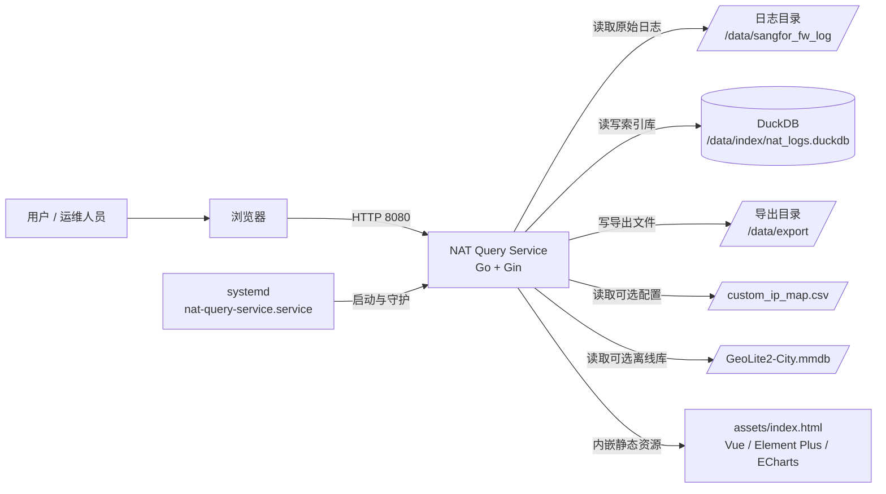

说明：
- 用户只接触浏览器页面，所有数据请求都进入 Go 服务。
- Go 服务同时承担静态页面、API、日志解析、索引维护、导出文件下载。
- DuckDB 是核心查询索引库，既存业务数据表 `nat_logs`，也存运行配置表 `app_settings` 和摄取快照表 `ingest_files`。
- 日志摄取只面向轮转后的归档日志，例如 `.log-YYYYMMDD` 和 `.log-YYYYMMDD.gz`；当天仍在写入的在线 `.log` 不进入索引。
- systemd 负责启动、重启、日志输出和运行权限约束。

## 2. 部署架构图

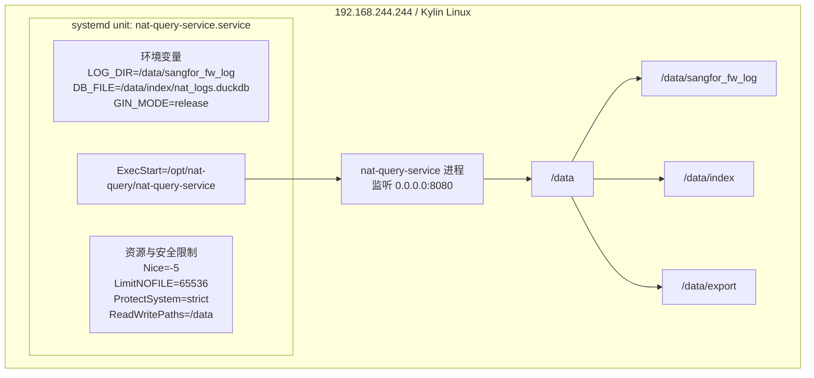

关键点：
- 服务工作目录是 `/opt/nat-query`。
- 只允许写 `/data`，所以日志目录、索引库、导出目录都放在 `/data` 下。
- 日志通过 `journalctl -u nat-query-service` 查看。

## 3. 后端运行时模块图

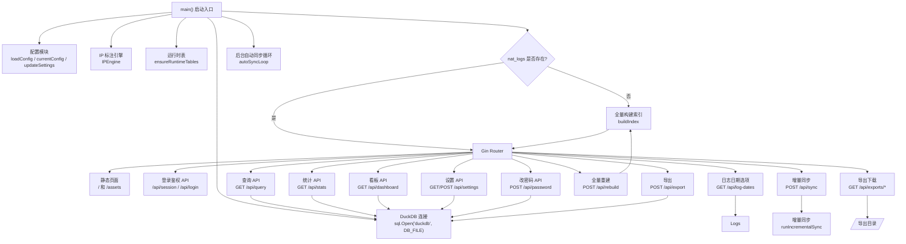

## 4. 数据库逻辑结构图

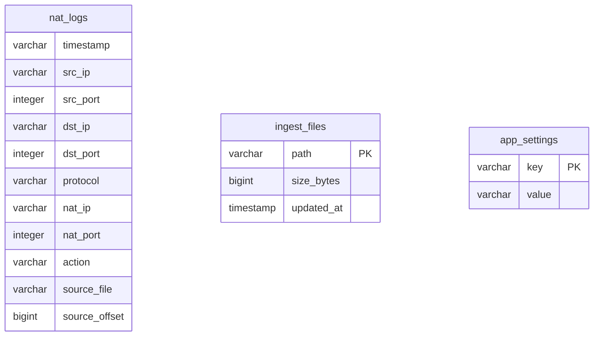

表职责：
- `nat_logs`：查询主表，来自原始 NAT 日志解析后的结构化记录。
- `ingest_files`：记录每个日志文件上次摄取到的大小，用于判断增量范围。
- `app_settings`：持久化页面设置，例如日志目录、自动同步开关、同步间隔、日志标志。

当前查询索引设计：

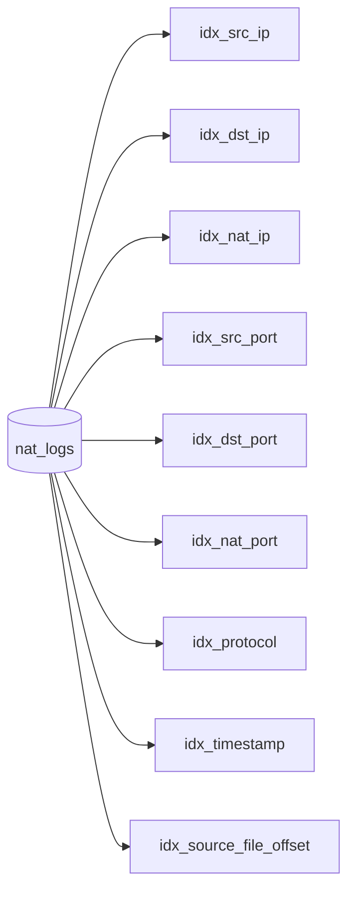

`idx_source_file_offset` 用于增量同步删除重叠区间，其他索引用于查询过滤和排序。

## 5. 前端页面交互图

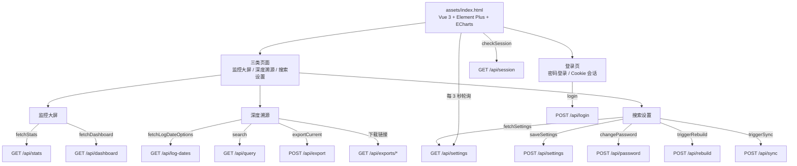

前端启动流程：

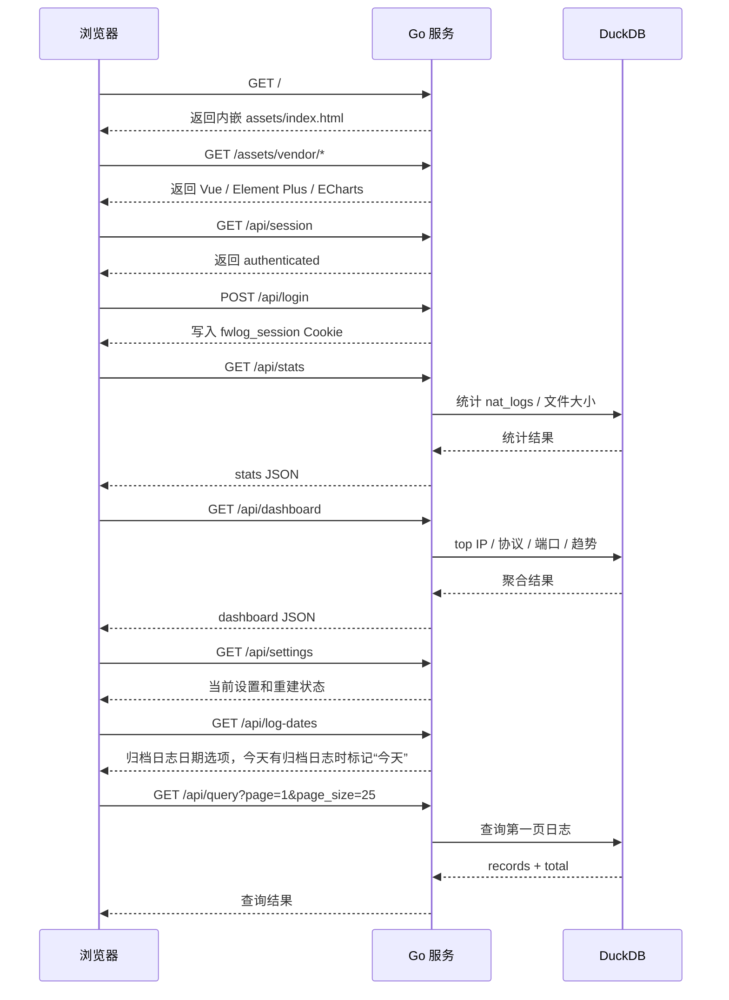

## 6. 服务启动流程图

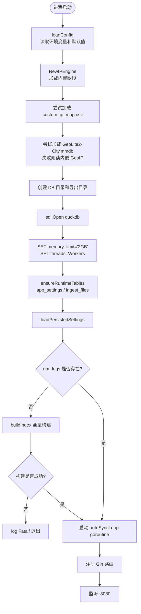

## 7. 全量索引构建流程图

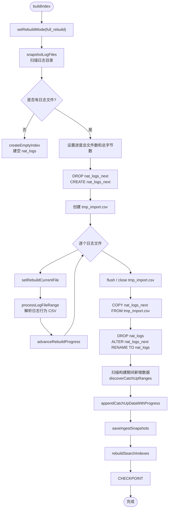

全量构建的关键设计：
- 使用 `nat_logs_next` 作为临时表，避免构建中破坏旧表。
- 所有文件先解析为临时 CSV，再用 DuckDB `COPY` 批量导入。
- 切表后再处理构建期间增长的日志区间，减少漏数据窗口。
- 当前扫描范围只包含归档日志，不直接读取仍在增长的当天 `.log`。
- 最后保存 `ingest_files` 快照，作为后续增量同步基线。

## 8. 原始日志解析流程图

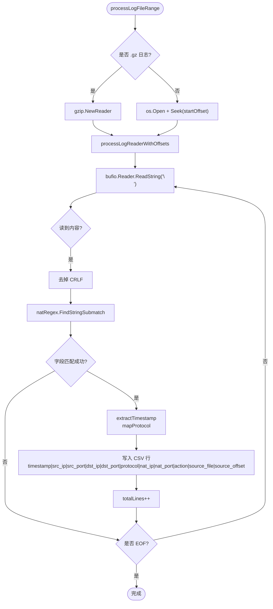

解析输出字段映射：

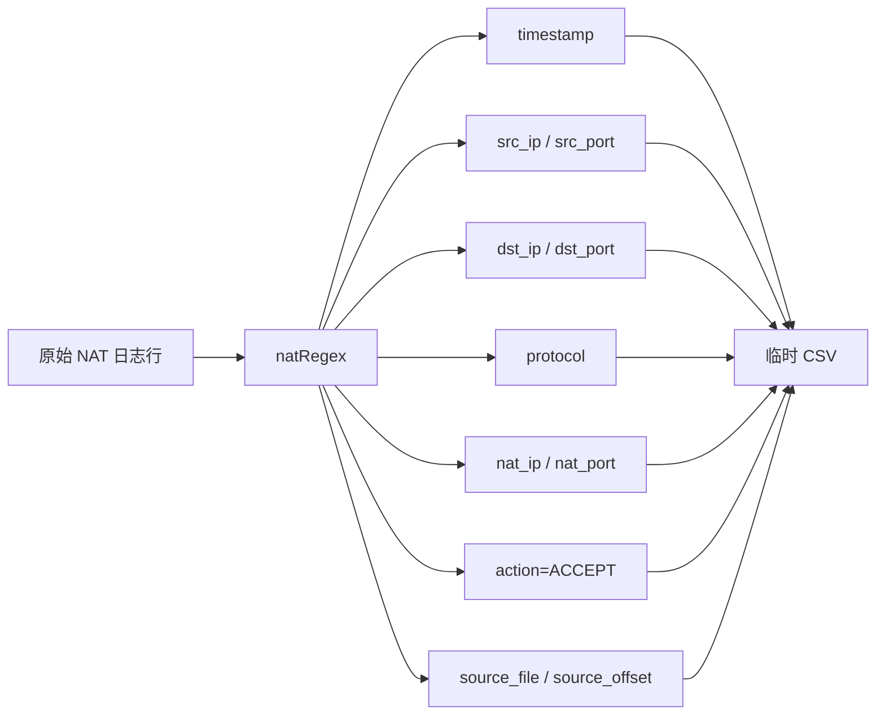

## 9. 增量同步流程图

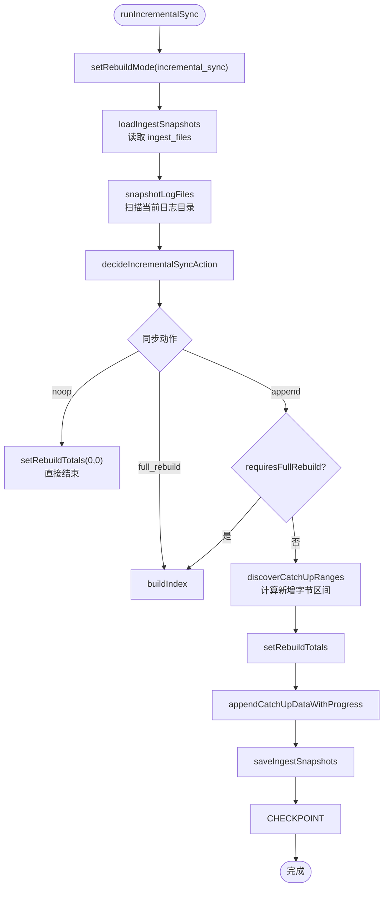

增量同步动作判断：

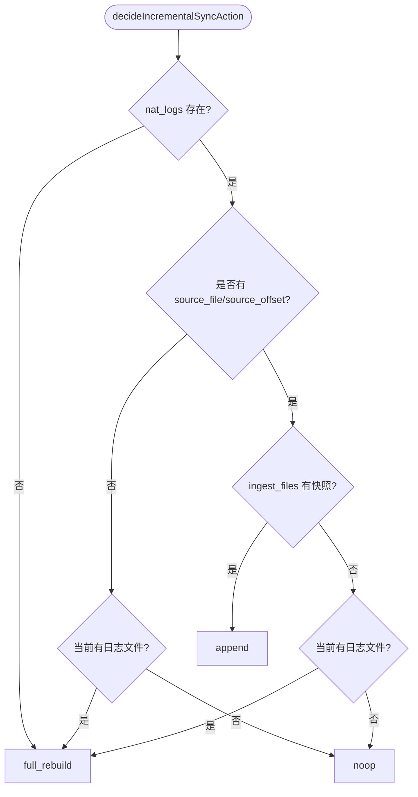

增量追加导入流程：

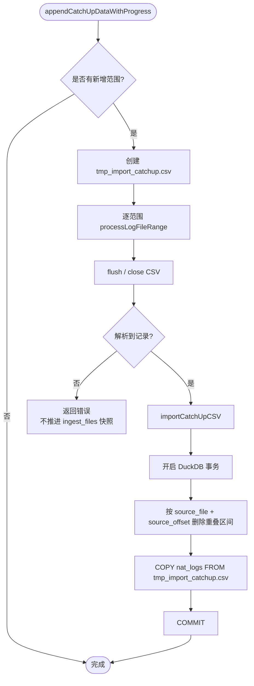

注意：增量同步期间只读请求不再由应用层主动阻断；全量重建仍会阻断查询、看板和导出。增量导入不再每轮删除并重建查询索引，以降低 DuckDB 写入期间对查询的影响。若新增范围有字节但解析不到 NAT 记录，系统会报错并保留旧快照，避免把未成功摄取的归档文件标记为已同步。

## 10. 自动同步循环图

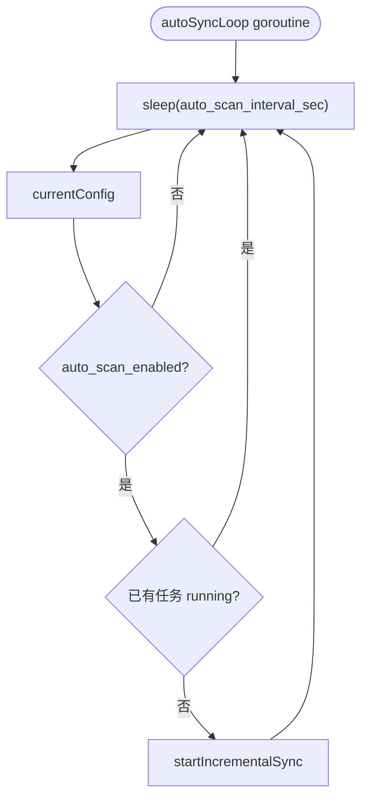

自动同步是后台循环，不直接由用户触发；页面上的“增量同步”按钮走的是 `POST /api/sync`。

运行中允许保存 `auto_scan_enabled=false`，用于手动关闭下一轮自动增量；运行中修改日志目录仍会被拒绝，因为目录变化会触发全量重建。

## 11. 查询流程图

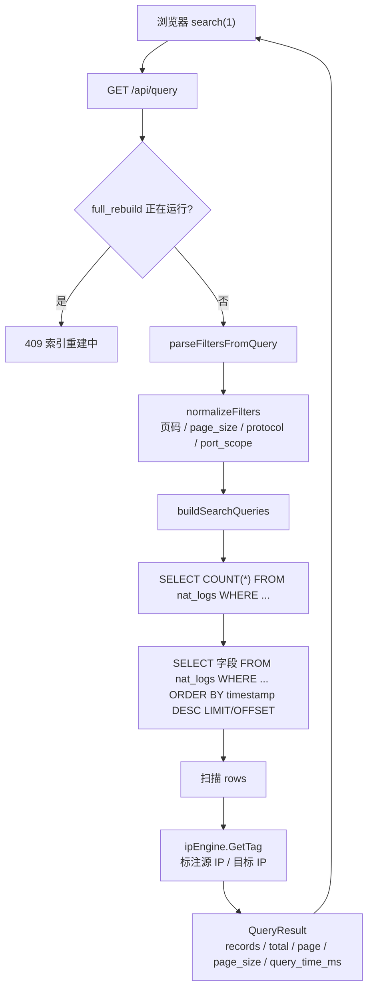

查询条件拼接逻辑：

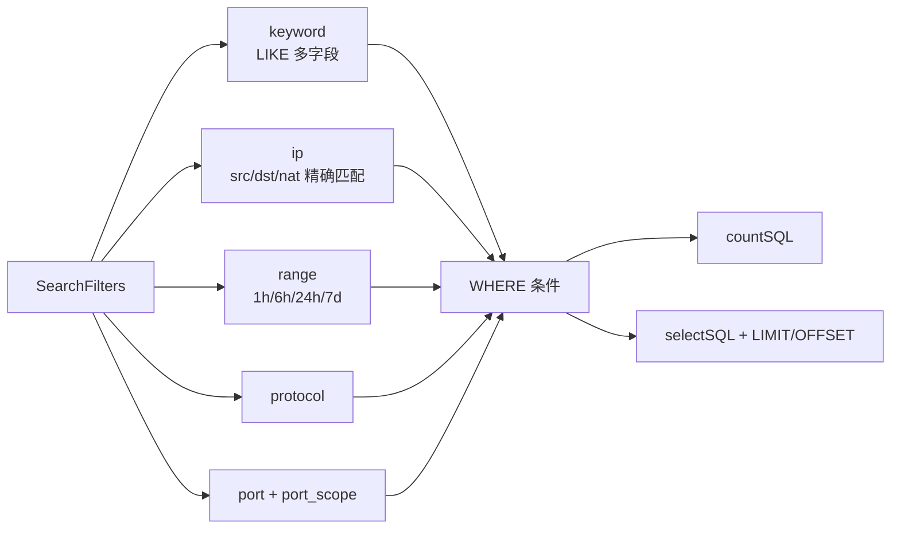

## 12. IP 标注流程图

```mermaid
flowchart TD
    Start([IPEngine.GetTag(ip)]) --> Override{"custom_ip_map.csv<br/>是否手工覆盖?"}
    Override -- 是 --> Manual["返回手工标签<br/>IsManual=true"]
    Override -- 否 --> Parse{"net.ParseIP 成功?"}
    Parse -- 否 --> Invalid["非法 IP / 未知"]
    Parse -- 是 --> Segment{"命中内置网段?"}
    Segment -- 是 --> Gov["政务网私有段 / 内网"]
    Segment -- 否 --> Private{"ip.IsPrivate?"}
    Private -- 是 --> LAN["局域网 / 内网"]
    Private -- 否 --> Geo{"GeoIP 可用且查询成功?"}
    Geo -- 是 --> PublicGeo["公网 IP / 国家城市"]
    Geo -- 否 --> PublicUnknown["公网 IP / 未知公网"]
```

内置网段：
- `172.18.0.0/17`
- `172.28.128.0/19`
- `2.0.0.0/8`

## 13. 监控大屏数据流程图

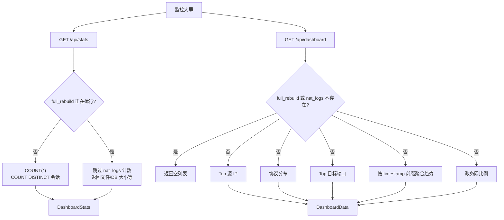

## 14. 设置保存与重建流程图

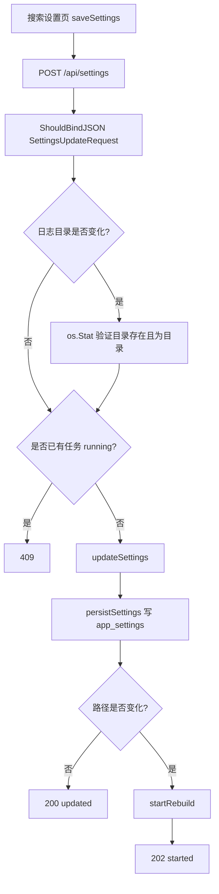

## 15. 手动重建流程图

```mermaid
sequenceDiagram
    participant U as 用户
    participant B as 浏览器
    participant S as Go 服务
    participant G as 后台 goroutine
    participant D as DuckDB

    U->>B: 点击“仅重建索引”
    B->>S: POST /api/rebuild
    S->>S: startRebuild 检查 rebuildState
    alt 已有任务 running
        S-->>B: 409
    else 可以启动
        S->>G: go buildIndex()
        S-->>B: 202 started
        G->>D: 全量扫描、COPY、切表、建索引
        G->>S: setRebuildFinished
        B->>S: 每 3 秒 GET /api/settings
        S-->>B: 进度 / 状态 / 当前文件
    end
```

## 16. 手动增量同步流程图

```mermaid
sequenceDiagram
    participant U as 用户
    participant B as 浏览器
    participant S as Go 服务
    participant G as 后台 goroutine
    participant D as DuckDB

    U->>B: 点击“增量同步”
    B->>S: POST /api/sync
    S->>S: startIncrementalSync 检查 rebuildState
    alt 已有任务 running
        S-->>B: 409
    else 可以启动
        S->>G: go runIncrementalSync()
        S-->>B: 202 started
        G->>D: 读取 ingest_files
        G->>G: 扫描日志目录并计算新增范围
        G->>D: 追加导入 / 必要时全量重建
        G->>D: 保存 ingest_files
        G->>S: setRebuildFinished
        B->>S: 每 3 秒 GET /api/settings
        S-->>B: 进度 / 状态
    end
```

## 17. 导出流程图

```mermaid
flowchart TD
    Browser["点击导出结果"] --> ExportAPI["POST /api/export"]
    ExportAPI --> Block{"full_rebuild 正在运行?"}
    Block -- 是 --> Conflict["409 暂时无法导出"]
    Block -- 否 --> Parse["parseFiltersFromJSON"]
    Parse --> SQL["buildSearchQueries(paginate=false)"]
    SQL --> Query["db.Query"]
    Query --> Category["resolveExportCategory<br/>by_ip/by_port/by_protocol/by_date/by_query"]
    Category --> FileName["buildExportFileName"]
    FileName --> Mkdir["创建 /data/export/category"]
    Mkdir --> CSV["写 CSV 表头和记录"]
    CSV --> HasRows{"导出条数 > 0?"}
    HasRows -- 否 --> Remove["删除空文件<br/>返回 400"]
    HasRows -- 是 --> Resp["ExportResponse<br/>file_name/category/exported_count/download_path"]
    Resp --> Browser
    Browser --> Download["GET /api/exports/category/file.csv"]
    Download --> SafePath["路径清理和越界检查"]
    SafePath --> File["FileAttachment"]
```

导出目录分类：
- `by_ip`
- `by_port`
- `by_protocol`
- `by_date`
- `by_query`

## 18. 重建状态机

```mermaid
stateDiagram-v2
    [*] --> idle
    idle --> running: startRebuild / startIncrementalSync
    running --> succeeded: setRebuildFinished(nil)
    running --> failed: setRebuildFinished(err)
    succeeded --> running: 下一次任务
    failed --> running: 下一次任务
```

状态字段：
- `Status`：`idle`、`running`、`succeeded`、`failed`
- `Mode`：`full_rebuild`、`incremental_sync`
- `StartedAt` / `FinishedAt`
- `CurrentFile`
- `FilesTotal` / `FilesDone`
- `BytesTotal` / `BytesDone`
- `Error`

页面进度条由 `/api/settings` 返回的这些字段驱动。

## 19. API 总览图

```mermaid
flowchart TB
    API["HTTP API :8080"] --> Page["GET /"]
    API --> Assets["GET /assets/*"]
    API --> Query["GET /api/query"]
    API --> Session["GET /api/session"]
    API --> Login["POST /api/login"]
    API --> Logout["POST /api/logout"]
    API --> Password["POST /api/password"]
    API --> LogDates["GET /api/log-dates"]
    API --> Stats["GET /api/stats"]
    API --> TopIPs["GET /api/top-ips"]
    API --> Dashboard["GET /api/dashboard"]
    API --> SettingsGet["GET /api/settings"]
    API --> SettingsPost["POST /api/settings"]
    API --> SettingsLogDir["POST /api/settings/log-dir"]
    API --> Rebuild["POST /api/rebuild"]
    API --> Sync["POST /api/sync"]
    API --> Export["POST /api/export"]
    API --> Download["GET /api/exports/*filepath"]
```

接口职责表：

| 接口 | 方法 | 职责 | 主要后端函数 |
| --- | --- | --- | --- |
| `/` | GET | 返回单页应用 HTML | `serveIndex` |
| `/assets/*` | GET | 返回内嵌静态资源 | `r.StaticFS` |
| `/api/session` | GET | 查询当前登录态 | `handleSession` |
| `/api/login` | POST | 密码登录并写入会话 Cookie | `handleLogin` |
| `/api/logout` | POST | 清理会话 Cookie | `handleLogout` |
| `/api/password` | POST | 校验旧密码并更新登录密码 | `handleChangePassword` |
| `/api/log-dates` | GET | 返回归档日志日期筛选选项 | `handleLogDates` |
| `/api/query` | GET | 条件查询、分页、IP 标注 | `handleQuery` |
| `/api/stats` | GET | 总记录、文件数、DB 大小、会话数 | `handleStats` |
| `/api/top-ips` | GET | Top 内网源 IP | `handleTopIPs` |
| `/api/dashboard` | GET | 看板聚合数据 | `handleDashboardData` |
| `/api/settings` | GET | 当前配置和任务状态 | `handleSettings` |
| `/api/settings` | POST | 保存设置，必要时重建 | `handleSetLogDir` |
| `/api/settings/log-dir` | POST | 兼容设置日志目录 | `handleSetLogDir` |
| `/api/rebuild` | POST | 启动全量重建 | `handleRebuild` |
| `/api/sync` | POST | 启动增量同步 | `handleSync` |
| `/api/export` | POST | 导出当前筛选结果 | `handleExport` |
| `/api/exports/*filepath` | GET | 下载导出文件 | `handleExportDownload` |

## 20. 关键数据流总图

```mermaid
flowchart LR
    RawLogs[/原始日志文件/] --> Parser["日志解析器<br/>natRegex + processLogReaderWithOffsets"]
    Parser --> TempCSV[/tmp_import*.csv/]
    TempCSV --> DuckCopy["DuckDB COPY"]
    DuckCopy --> NatLogs[(nat_logs)]
    NatLogs --> QueryAPI["查询 / 看板 / 导出 API"]
    QueryAPI --> IPEngine["IP 标注"]
    IPEngine --> JSON["JSON 响应"]
    JSON --> Frontend["Vue 页面"]

    NatLogs --> ExportCSV[/导出 CSV/]
    ExportCSV --> Download["浏览器下载"]

    RawLogs --> Snapshots["文件快照"]
    Snapshots --> Ingest[(ingest_files)]
    Ingest --> Incremental["增量同步范围计算"]
    Incremental --> TempCSV
```

## 21. 当前已知边界与待验证项

```mermaid
flowchart TD
    Known["当前已确认"] --> K1["244 服务已恢复可查"]
    Known --> K2["索引库现有记录可通过 /api/query 查询"]
    Known --> K3["增量同步卡慢曾发生在 COPY/索引维护阶段"]

    Draft["源码草稿中已有修复方向"] --> D1["增量同步不再阻断只读请求"]
    Draft --> D2["时间范围过滤不再按 syslog 字符串直接比较"]
    Draft --> D3["导出不再固定 page_size=200"]
    Draft --> D4["只索引归档日志，不读取在线 .log"]
    Draft --> D5["增量导入不再删除并重建索引"]
    Draft --> D6["运行中允许关闭自动增量"]

    Need["仍需验证"] --> N1["通过 GitHub Actions 完成 go test"]
    Need --> N2["通过 CI artifact 验证兼容构建方案"]
    Need --> N3["在 244 等价数据量上压测增量同步耗时"]
    Need --> N4["最终再出二进制包并灰度替换"]
```

## 22. CI 测试与产物生成流程图

```mermaid
flowchart TD
    Push["push / pull_request / workflow_dispatch"] --> CI[".github/workflows/ci.yml"]
    CI --> TestLinux["ubuntu-24.04<br/>go test ./..."]
    CI --> TestKylin["manylinux_2_28_x86_64<br/>Kylin V10 SP1 基线测试"]
    TestLinux --> BuildLinux["构建 linux-amd64 临时产物"]
    TestKylin --> BuildKylin["构建 kylin-v10-sp1-x86_64 临时产物"]
    BuildLinux --> Artifact["upload-artifact<br/>Actions 页面下载"]
    BuildKylin --> Artifact

    Tag["push tag v* / 手动 release-build"] --> Release[".github/workflows/release-build.yml"]
    Release --> ReleaseAssets["发布正式 Release assets"]
```

说明：
- CI workflow 用于验证和生成临时 artifact，不等同于正式发版。
- 正式二进制包仍由 `release-build.yml` 在 tag 或手动触发时生成。
- 当前阶段先在 `kos991/fwlog` 仓库用 CI 跑测试和构建，244 环境问题全部修复验证后再考虑正式包。

## 23. 推荐排障入口图

```mermaid
flowchart TD
    Symptom["线上现象"] --> QueryBad{"查询 409 / 空结果?"}
    QueryBad -- 是 --> Settings["GET /api/settings<br/>看 rebuild_status / mode"]
    Settings --> Running{"running?"}
    Running -- full_rebuild --> WaitOrLog["全量重建，查看进度和日志"]
    Running -- incremental_sync --> Perf["看 CPU/I/O，判断是否卡在增量导入"]
    Running -- 否 --> QuerySQL["查筛选条件和 SQL 时间范围"]

    Symptom --> Slow{"重建/同步很慢?"}
    Slow -- 是 --> Metrics["top / pidstat / iostat / journalctl"]
    Metrics --> CPU{"CPU 高且 I/O 低?"}
    CPU -- 是 --> DuckCPU["DuckDB 计算或索引维护热点"]
    CPU -- 否 --> IO{"I/O wait 高?"}
    IO -- 是 --> Disk["磁盘吞吐/队列瓶颈"]
    IO -- 否 --> Lock["锁等待或外部阻塞"]

    Symptom --> Missing{"日志不全?"}
    Missing -- 是 --> Count["对比原始文件范围、ingest_files、nat_logs count"]
    Count --> TimeRange["检查时间过滤是否跨月/跨年"]
    Count --> Snapshot["检查文件快照是否漏新增区间"]
```
