# NAT Query Service ClickHouse 版架构图与流程图

本文档描述 ClickHouse 版目标架构。核心目标是：后台持续导入归档 NAT 日志，用户查询始终可用；查询只读取已经校验完成的日期，避免看到半成品数据。

## 1. 核心原则

- 数据库支持一边写一边读，但应用层必须做可见性控制。
- 不再使用全局“索引重建中，请稍后再试”阻断查询。
- 不再生成巨大 `tmp_import.csv`，`.gz` 归档日志必须流式解压、流式解析、批量写入。
- 不读取当天仍在线写入的 `.log` 文件，只读取归档日志：`.log-YYYYMMDD` 和 `.log-YYYYMMDD.gz`。
- 按日期导入、按日期校验、按日期开放查询。
- 旧 DuckDB 数据不进入新系统，迁移时直接弃用。
- Go 解析层不写入 `Nullable` 字段；缺失值统一写默认值，例如空字符串、`0`、`0.0.0.0`。
- 日期级重建必须可快速清理，因此第一版主表按天分区。
- Go 端使用官方 `github.com/ClickHouse/clickhouse-go/v2` native TCP 驱动；批量写入使用 `PrepareBatch`，不走 HTTP 写入，也不把 `database/sql` 作为主路径。
- 日志目录必须能在 Web 页面自定义，并绑定自定义标识；导入时把标识写入 ClickHouse，查询结果和导出结果都要带上该标识。
- IP 标注库必须能在 Web 页面自定义；支持自定义 IP 映射文件和 GeoIP 库路径，保存后热加载，不要求重启服务。

## 2. 系统上下文图

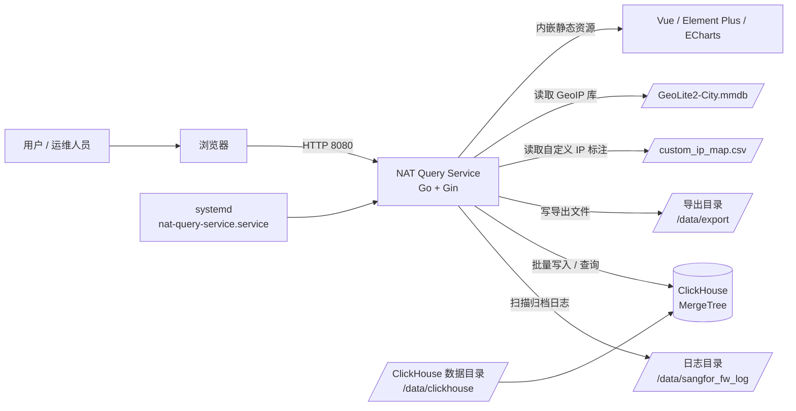

## 3. 部署架构图

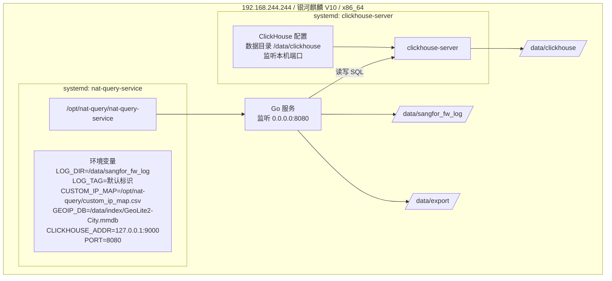

Go 连接配置建议：

```go
conn, err := clickhouse.Open(&clickhouse.Options{
	Addr: []string{"127.0.0.1:9000"},
	Auth: clickhouse.Auth{
		Database: "default",
	},
	DialTimeout:     10 * time.Second,
	MaxOpenConns:    10,
	MaxIdleConns:    5,
	ConnMaxLifetime: time.Hour,
})
```

连接池约束：

- 查询、状态表读写和导入共用连接池时，`MaxOpenConns` 第一版控制在 `10`，避免 Go 服务把 ClickHouse 连接打满。
- 大批量 NAT 日志写入必须使用 `PrepareBatch`，由驱动构建 ClickHouse block 并通过 native TCP 写入。
- `database/sql` 只允许作为兼容层评估，不作为生产导入主路径。

## 4. 目标数据模型

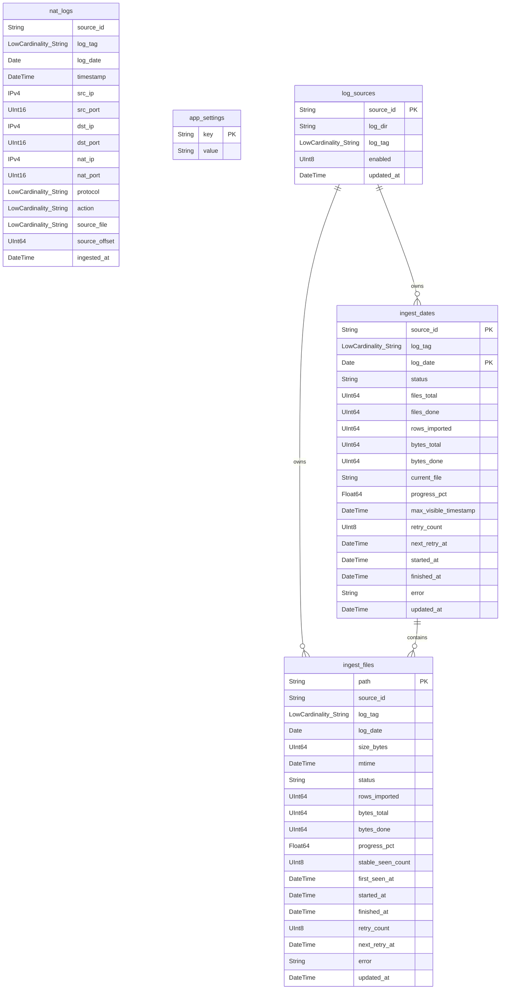

推荐主表：

```sql
CREATE TABLE nat_logs
(
    source_id String CODEC(ZSTD(3)),
    log_tag LowCardinality(String) CODEC(ZSTD(3)),
    log_date Date CODEC(DoubleDelta, ZSTD(3)),
    timestamp DateTime CODEC(DoubleDelta, ZSTD(3)),
    src_ip IPv4 CODEC(ZSTD(3)),
    src_port UInt16 CODEC(T64, ZSTD(3)),
    dst_ip IPv4 CODEC(ZSTD(3)),
    dst_port UInt16 CODEC(T64, ZSTD(3)),
    nat_ip IPv4 CODEC(ZSTD(3)),
    nat_port UInt16 CODEC(T64, ZSTD(3)),
    protocol LowCardinality(String) CODEC(ZSTD(3)),
    action LowCardinality(String) CODEC(ZSTD(3)),
    source_file LowCardinality(String) CODEC(ZSTD(3)),
    source_offset UInt64 CODEC(Delta, ZSTD(3)),
    ingested_at DateTime DEFAULT now() CODEC(DoubleDelta, ZSTD(3))
)
ENGINE = MergeTree
PARTITION BY log_date
ORDER BY (log_date, source_id, src_ip, dst_ip, nat_ip, timestamp)
SETTINGS index_granularity = 8192;
```

排序键说明：

- 当前排序键优先满足“时间 + 日志源 + 源 IP”查询，这是 Web 普通搜索的主路径。
- 如果后续经常按 `nat_ip + nat_port` 反查内网用户，再增加面向 NAT 反查的物化视图，或评估 ClickHouse skip index。
- 第一版不使用 `Nullable`，解析失败或字段缺失由 Go 层写默认值，减少存储和查询开销。
- 第一版使用 `PARTITION BY log_date`，便于日期级重建时直接删除单日分区；如果后续保留多年数据导致分区过多，再评估月分区加替代表。

推荐状态表：

```sql
CREATE TABLE ingest_dates
(
    source_id String,
    log_tag LowCardinality(String),
    log_date Date,
    status LowCardinality(String),
    files_total UInt64,
    files_done UInt64,
    rows_imported UInt64,
    bytes_total UInt64,
    bytes_done UInt64,
    current_file String,
    progress_pct Float64,
    max_visible_timestamp DateTime,
    retry_count UInt8,
    next_retry_at DateTime,
    started_at DateTime,
    finished_at DateTime,
    error String,
    updated_at DateTime DEFAULT now()
)
ENGINE = ReplacingMergeTree(updated_at)
PRIMARY KEY (source_id, log_date)
ORDER BY (source_id, log_date);

CREATE TABLE ingest_files
(
    path String,
    source_id String,
    log_tag LowCardinality(String),
    log_date Date,
    size_bytes UInt64,
    mtime DateTime,
    status LowCardinality(String),
    rows_imported UInt64,
    bytes_total UInt64,
    bytes_done UInt64,
    progress_pct Float64,
    stable_seen_count UInt8,
    first_seen_at DateTime,
    started_at DateTime,
    finished_at DateTime,
    retry_count UInt8,
    next_retry_at DateTime,
    error String,
    updated_at DateTime DEFAULT now()
)
ENGINE = ReplacingMergeTree(updated_at)
PRIMARY KEY path
ORDER BY path;

CREATE TABLE log_sources
(
    source_id String,
    log_dir String,
    log_tag LowCardinality(String),
    enabled UInt8,
    updated_at DateTime DEFAULT now()
)
ENGINE = ReplacingMergeTree(updated_at)
PRIMARY KEY source_id
ORDER BY source_id;
```

日志源配置说明：

- `source_id` 由 Go 生成稳定 ID，建议使用日志目录规范化路径的 hash，避免目录名修改显示文本后破坏关联。
- `log_dir` 是实际归档日志目录，例如 `/data/sangfor_fw_log`。
- `log_tag` 是页面自定义标识，例如“出口防火墙”“10.10.10.1”“办公区 NAT”。
- 第一版支持单目录；数据模型按多目录设计，后续可以在 Web 页面增加多个日志源。
- `nat_logs.log_tag` 写入导入时刻的标识，历史数据不随页面改名自动变更；如果需要统一改历史标识，走指定 `source_id` 的维护任务。

增量可见性字段说明：

- `max_visible_timestamp` 用于小时级归档的可见性控制；天级归档导完后设置为该日 `23:59:59`。
- `retry_count` 和 `next_retry_at` 用于失败文件或失败日期的指数退避重试。
- `stable_seen_count` 用于文件静置判断，连续两轮扫描 size 和 mtime 不变才允许入队。
- 第一版优先使用天级发布；如果确认防火墙按小时归档，再启用 `max_visible_timestamp` 做小时级平滑开放。

导入进度字段说明：

- `bytes_total` 和 `bytes_done` 用于展示字节级进度；gzip 文件按压缩文件大小估算读取进度。
- `files_total` 和 `files_done` 用于展示日期级文件进度。
- `current_file` 用于页面显示当前正在处理的归档文件。
- `progress_pct` 由 Go 写入或查询时计算，范围 `0` 到 `100`。
- `started_at`、`finished_at` 用于页面展示耗时、最近完成时间和失败发生时间。

状态表默认放在 ClickHouse 普通业务库中，避免再引入本地 SQLite 状态漂移。读取状态时按最新 `updated_at` 取值，不能把 ReplacingMergeTree 尚未合并的旧版本误判为当前状态。

状态表查询必须使用以下两种方式之一：

```sql
SELECT status, files_total, files_done, rows_imported
FROM ingest_dates
WHERE log_date = '2026-06-28'
ORDER BY updated_at DESC
LIMIT 1;
```

```sql
SELECT log_date, status, files_total, files_done, rows_imported
FROM ingest_dates FINAL;
```

状态表规模很小，`FINAL` 可以用于 `/api/log-dates` 这类全量状态读取；查询单个日期状态时优先用 `ORDER BY updated_at DESC LIMIT 1`。

自动增量配置存入 `app_settings`：

| key | 默认值 | 说明 |
| --- | --- | --- |
| `auto_scan_enabled` | `false` | 是否开启自动增量 |
| `auto_scan_mode` | `hourly` | 执行模式：`hourly` / `daily` / `custom` |
| `auto_scan_times` | `01:00` | 页面配置的执行时间，多个时间用逗号分隔，例如 `01:00,12:00,18:00` |
| `auto_scan_interval_sec` | `3600` | 兼容旧配置；`hourly` 模式下作为兜底间隔 |
| `auto_scan_timezone` | `Asia/Shanghai` | 调度时区，244 默认使用北京时间 |
| `auto_scan_jitter_sec` | `60` | 启动偏移，避免整点与其他任务同时抢 I/O |

Web 页面必须允许运维直接修改这些配置，保存后无需重启服务，下一轮调度立即按新配置计算。

IP 标注库配置存入 `app_settings`：

| key | 默认值 | 说明 |
| --- | --- | --- |
| `custom_ip_map_path` | `/opt/nat-query/custom_ip_map.csv` | 自定义 IP 映射 CSV 文件路径 |
| `geoip_db_path` | `/data/index/GeoLite2-City.mmdb` | GeoIP 城市库路径 |
| `ip_map_enabled` | `true` | 是否启用自定义 IP 映射 |
| `geoip_enabled` | `true` | 是否启用 GeoIP 标注 |
| `ip_data_updated_at` | 空 | 最近一次成功加载 IP 库的时间 |

Web 页面必须提供 IP 库路径配置、文件存在性检测、手动重新加载按钮。保存成功后 Go 服务热加载新路径；热加载失败时保留旧的已加载 IP 库，并在页面显示错误。

## 5. 读写隔离架构图

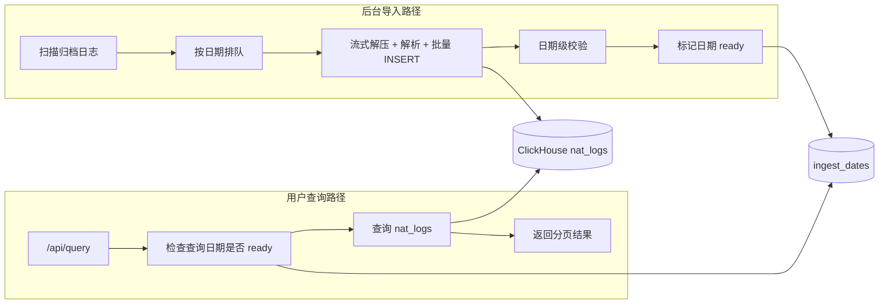

关键点：

- ClickHouse 负责并发读写能力。
- `ingest_dates` 负责用户可见性。
- 正在导入的日期不作为完整数据对用户开放。
- 已经 `ready` 的日期不受后台导入影响。
- 查询构造 SQL 前必须先拿到 `ready` 日期集合，并把 `log_date IN (...)` 注入查询条件。

查询可见性伪代码：

```go
func BuildQuerySQL(req QueryRequest) (string, error) {
	startDate, endDate := req.GetDateRange()
	readyDates := stateStore.GetReadyDates(startDate, endDate)
	if len(readyDates) == 0 {
		return "", errors.New("所选时间段内的日志尚在导入中或无可查数据")
	}
	return buildClickHouseSQL(req, readyDates), nil
}
```

## 6. 服务启动流程图

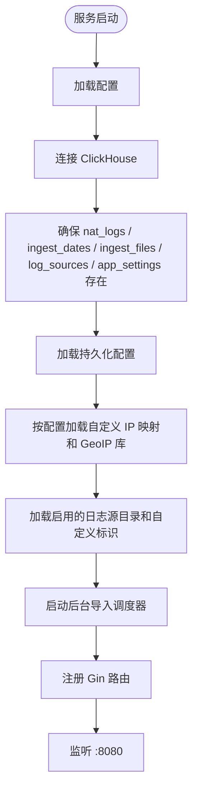

启动时不触发同步全量重建。服务先起来，后台调度器根据状态表决定下一步导入任务。

## 7. 文件扫描与日期队列流程图

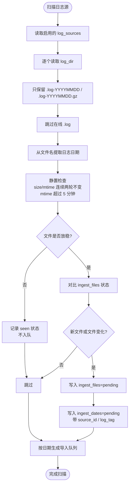

增量触发策略：

- 不使用 `fsnotify` / `inotify` 实时监听日志目录，避免大量写入事件导致 Go 事件队列溢出。
- 使用服务内 `autoSyncLoop` 每小时整点扫描一次；也可以由 crontab 或 systemd timer 调用 `/api/sync` 作为外部兜底。
- 凌晨 `01:00` 作为重点扫描窗口，专门抓取昨天刚切分和压缩完成的归档。
- 新发现的 `.gz` 文件必须通过静置判断：连续两次扫描 size 和 mtime 不变，并且当前时间距离 mtime 超过 `5 分钟`，才允许进入 `pending`。
- 坚决不读取当天在线 `.log`，白天增量只认已切分出的历史归档。
- 每个日志源独立扫描、独立记录 `source_id` 和 `log_tag`；同名文件在不同目录下不能互相覆盖。

## 8. 流式解压导入流程图

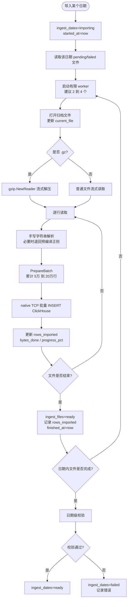

不允许再走以下路径：

```text
.gz -> 全量落地解压 -> tmp_import.csv -> COPY -> 建索引 -> 阻断查询
```

必须走以下路径：

```text
.gz -> 流式解压 -> 批量 INSERT -> 文件 ready -> 日期 ready
```

导入参数：

- 批次大小固定在 `100000` 到 `200000` 行之间，优先使用 `100000` 起步压测。
- worker 数使用 `max(2, CPU核心数/2)`，并设置上限，244 第一版建议 `2` 到 `4`。
- worker 到写入器之间使用有界队列，防止解压和解析速度高于 ClickHouse 写入速度时撑爆内存。
- 每次批量 `INSERT` 使用 `context.WithTimeout`，默认 `30s`；失败后指数退避重试。
- 写入失败不能推进 `ingest_files` 和 `ingest_dates` 状态。
- 写入器使用 `clickhouse-go/v2` 的 `PrepareBatch`；每批 `Append` 完成后调用 `Send`，禁止先拼接巨大 SQL 或落地 CSV。
- 每次成功 `Send` 后更新进度状态；页面轮询时必须能看到 `rows_imported`、`bytes_done`、`current_file` 和 `progress_pct` 变化。

解析层性能约束：

- 日志格式固定时，优先使用 `strings.Index`、切片和手写字段扫描解析 NAT 行。
- 只有格式分支较多、手写解析难以维护时才使用 `regexp`；正则必须在初始化阶段 `regexp.MustCompile`，不能在循环内编译。
- 不把 `github.com/dlclark/regexp2` 作为默认性能优化路径；它适合兼容复杂正则语义，不适合作为高吞吐 NAT 日志解析的第一选择。

增量限流与磁盘保护：

- 增量导入必须限流，默认每个 worker 解压解析不超过 `50 MB/s`，每次 `INSERT` 后保留 `500ms` 间隔，给前端查询、ClickHouse merge 和磁盘 I/O 留余量。
- 每轮导入前检查 `/data/clickhouse` 所在磁盘空间；可用空间低于 `15%` 时停止增量队列并报警。

## 9. 查询流程图

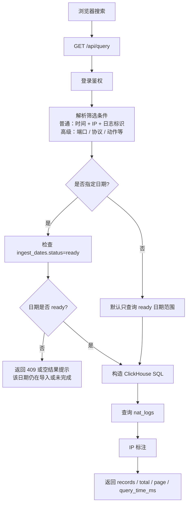

查询接口不再因为后台导入全局返回“索引重建中”。只有用户明确查询未完成日期时，才提示该日期尚未 ready。

IP 库热加载规则：

- 自定义 IP 映射 CSV 和 GeoIP 库都由 `ipEngine` 读取，查询结果中的源 IP、目的 IP 标注走当前已加载版本。
- 保存新路径或点击“重新加载 IP 库”时，Go 先在临时实例中加载新库；加载成功后再原子替换当前 `ipEngine`。
- 加载失败时保留旧库，`GET /api/settings` 返回最新错误，查询继续使用旧标注库。
- 自定义 IP 映射优先级高于 GeoIP；关闭 `ip_map_enabled` 后只使用 GeoIP 和内置网段规则。

## 10. 日期开放流程图

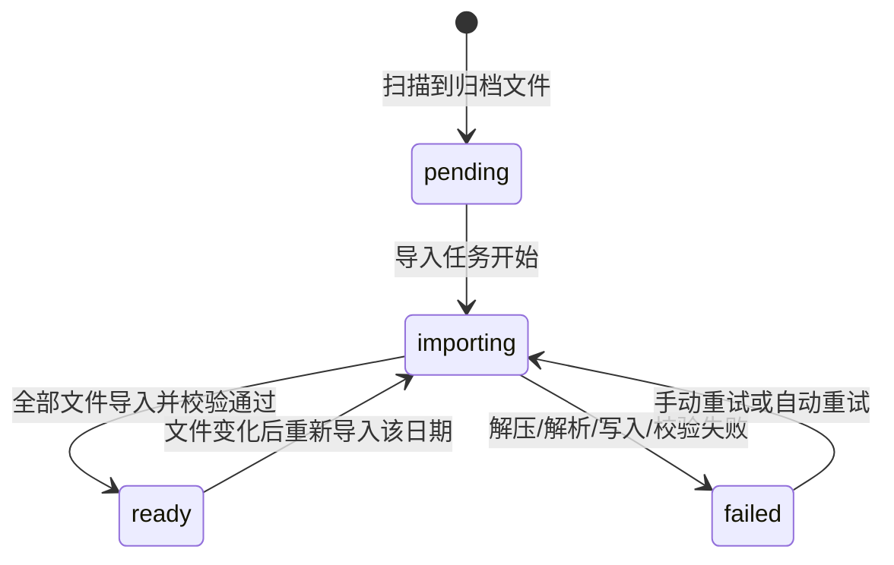

日期状态含义：

- `pending`：已发现文件，尚未开始导入。
- `importing`：正在导入，不对用户作为完整日期开放。
- `ready`：该日期可查询。
- `failed`：该日期导入失败，页面显示错误，可重试。

## 11. 手动重建流程图

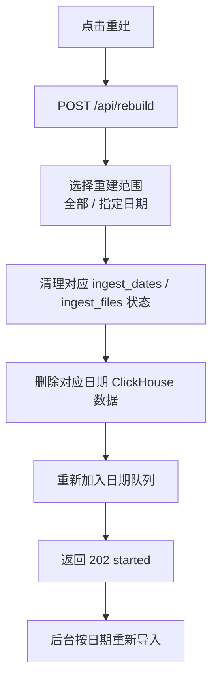

重建是日期级动作，不再是全局阻断动作。重建某一天时，只影响那一天的查询可见性，其他 `ready` 日期继续可查。

日期级重建清理策略：

```sql
ALTER TABLE nat_logs DROP PARTITION '2026-06-28';
```

只要某个日期没有最终进入 `ready`，重试时先清理该日期分区，再重新导入该日期全部文件。这样处理服务重启、导入到一半失败、重复点击重试等情况，保证幂等。

执行 `DROP PARTITION` 后，Go 侧不要立即开始同日批量写入。第一版采用保守策略：执行成功后 `time.Sleep(1 * time.Second)` 再重新导入该日期。不要在大表上常规执行 `OPTIMIZE TABLE nat_logs FINAL`；它只能作为小表或离线维护动作，避免白天影响查询。

小时级可见性策略：

- 如果防火墙每天只归档一次，推荐天级发布：昨天全部导入并校验通过后，整天从 `importing` 切到 `ready`。
- 如果防火墙每小时生成一个归档，仍保留 `ingest_dates`，但每导入并校验一个整点窗口后更新 `max_visible_timestamp`。
- 查询时除 `log_date IN readyDates` 外，再追加 `timestamp <= max_visible_timestamp`，避免用户看到未校验完成的小时数据。

## 12. 自动增量流程图

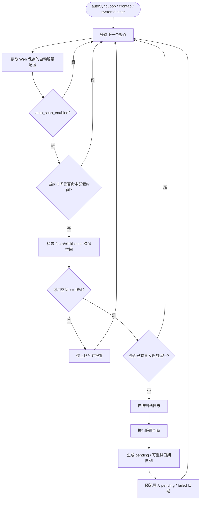

运行中允许关闭自动增量。关闭后当前批次可以按策略完成或停止，下一轮不再启动。

Web 自动增量时间控制：

- 设置页提供日志源配置：
  - 日志目录输入框，例如 `/data/sangfor_fw_log`。
  - 自定义标识输入框，例如“出口防火墙”。
  - 目录有效性检测按钮，保存前后端都要校验目录存在且可读。
  - 第一版只开放一个启用日志源；表结构和 API 保留多日志源扩展能力。
- 设置页提供 IP 库配置：
  - 自定义 IP 映射文件路径输入框，例如 `/opt/nat-query/custom_ip_map.csv`。
  - GeoIP 库路径输入框，例如 `/data/index/GeoLite2-City.mmdb`。
  - `ip_map_enabled` 和 `geoip_enabled` 开关。
  - 文件检测按钮和“重新加载 IP 库”按钮。
  - 页面显示最近一次成功加载时间和加载错误。
- 设置页提供“自动增量”开关，关闭后不再启动下一轮自动扫描。
- 设置页提供调度模式：
  - `hourly`：每小时执行一次，默认整点后加 `auto_scan_jitter_sec` 偏移。
  - `daily`：每天在 `auto_scan_times` 的第一个时间执行，默认 `01:00`。
  - `custom`：每天按 `auto_scan_times` 多个时间点执行。
- 页面提供时间选择器，支持增加、删除多个执行时间点。
- 页面保留“立即增量一次”按钮，对应 `POST /api/sync`，不改变自动调度配置。
- 如果当前已有导入任务运行，保存“关闭自动增量”必须允许；保存时间配置也允许，但只影响下一轮。
- 修改日志目录仍需要避免任务冲突，不能和运行中的导入任务同时进行。

Web 导入进度面板：

- 设置页展示总览：当前任务状态、当前日期、当前文件、文件进度、字节进度、已导入行数、耗时、预计剩余时间、最近错误。
- 日期列表展示每个日期的 `pending` / `importing` / `ready` / `failed` 状态、文件数、行数、进度百分比。
- 当前文件展示文件名、文件大小、已读字节、解析行数和重试次数。
- 前端每 `3s` 轮询一次进度接口；如果没有任务运行，可降频到每 `30s`。
- `ready` 日期显示绿色，`importing` 显示蓝色进度，`failed` 显示红色错误和“重试该日期”操作，`pending` 显示灰色等待。
- 进度面板不阻断搜索页面；搜索页面只根据日期 `ready` 状态控制可查范围。

增量重试策略：

- 单文件导入失败后标记 `ingest_files=failed`，记录错误、`retry_count` 和 `next_retry_at`。
- 自动重试使用指数退避：`1 分钟` -> `5 分钟` -> `15 分钟`，最多 `3 次`。
- 失败 3 次后停止自动重试，触发企业微信、钉钉或邮件告警，等待运维介入。
- 日期未进入 `ready` 前，下一次重试先清理该日期分区，再整日重导，保证幂等。

增量任务伪代码：

```go
func cronIncrementJob() {
	if !autoScanEnabled() {
		return
	}
	if !scheduleDueNow(loadAutoScanSchedule(), time.Now()) {
		return
	}
	if !hasEnoughDiskSpace("/data/clickhouse", 15) {
		alert("ClickHouse disk free space is below 15%")
		return
	}

	files := scanArchivedLogFiles()
	for _, file := range files {
		if isOnlineLog(file) {
			continue
		}
		if !isFileStable(file, 2, 5*time.Minute) {
			recordSeenFile(file)
			continue
		}
		if isFileImported(file) {
			continue
		}

		recordToIngestFiles(file, "pending")
		updateIngestDateStatus(file.Date, "pending")
	}

	enqueueRetryableDates()
	runRateLimitedImportQueue()
}
```
## 13. 冷热数据与压缩流程图

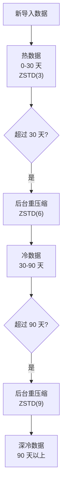

第一版建议先使用一张 `nat_logs` 表和 `ZSTD(3)`，跑稳后再增加 TTL 重压缩策略。当前 2.7GB `.gz` 数据预估：

```text
热数据 ZSTD(3)：约 4GB 到 6GB
冷数据 ZSTD(6/9)：约 3GB 到 5GB
导入与后台合并预留空间：建议 30GB 起
```

## 14. 完整性校验流程图

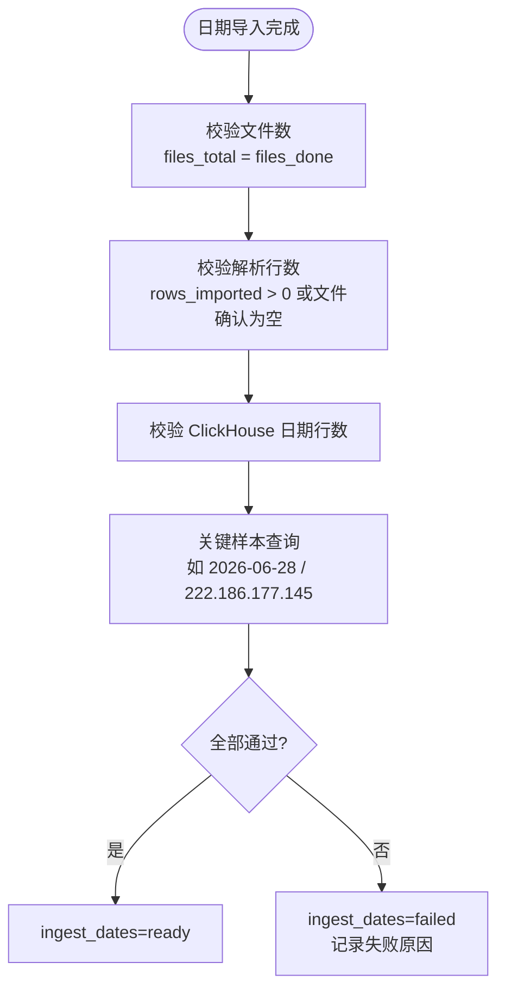

必须保留的验收点：

- `2026-06-28` 归档必须导入。
- `222.186.177.145` 必须可查。
- 查询结果时间范围必须落在告警窗口附近。
- `/api/query` 在其他 ready 日期上不因后台导入返回全局 409。

## 15. 数据流总图


## 16. API 行为变化

| 接口 | 新行为 |
| --- | --- |
| `GET /api/query` | 只查询 ready 日期；未完成日期返回明确提示，不再因后台导入全局阻断 |
| `GET /api/log-dates` | 返回日期状态：ready / importing / failed / pending |
| `GET /api/settings` | 返回导入任务状态、日志源目录、自定义标识、IP 库路径、当前日期、当前文件、进度、错误，并回显 `auto_scan_mode`、`auto_scan_times`、`auto_scan_timezone`、`auto_scan_jitter_sec` |
| `GET /api/ingest-progress` | 返回导入总进度、当前日期、当前文件、日期列表状态、下次自动增量时间 |
| `POST /api/settings` | 保存日志目录、自定义标识、IP 库路径、自动增量开关、执行模式、执行时间、限流配置；关闭自动增量不要求当前任务结束 |
| `POST /api/ip-data/reload` | 手动热加载自定义 IP 映射和 GeoIP 库；失败时保留旧库并返回错误 |
| `POST /api/rebuild` | 支持全量或指定日期重建，按日期重新导入 |
| `POST /api/sync` | 扫描归档并导入 pending/failed 日期 |

`GET /api/ingest-progress` 响应示例：

```json
{
  "status": "importing",
  "source_id": "src_7f3a9c1d",
  "log_tag": "出口防火墙",
  "current_date": "2026-06-28",
  "current_file": "10.10.10.1_2026-06-28.log-20260629.gz",
  "files_total": 12,
  "files_done": 5,
  "bytes_total": 2885096642,
  "bytes_done": 1420000000,
  "rows_imported": 5450000,
  "progress_pct": 49.22,
  "elapsed_sec": 320,
  "eta_sec": 330,
  "next_auto_scan_at": "2026-07-02 01:00:00",
  "error": "",
  "dates": [
    {
      "log_date": "2026-06-28",
      "status": "importing",
      "files_total": 12,
      "files_done": 5,
      "rows_imported": 5450000,
      "progress_pct": 49.22
    }
  ]
}
```

## 17. 关键风险与处理

| 风险 | 处理 |
| --- | --- |
| Go 驱动选错导致写入慢 | 使用官方 `clickhouse-go/v2` native TCP 和 `PrepareBatch` |
| `.gz` 解压慢 | 多文件有限并发，单文件流式解压，不落地明文 |
| 导入占用 CPU/IO | worker 限制、批量大小限制、限速、INSERT 间隔、ClickHouse 写入参数限制 |
| 正则解析成为 CPU 瓶颈 | 固定格式优先手写字符串解析；必须用正则时只用预编译 `regexp` |
| 用户查到半成品 | 查询只开放 `ready` 日期 |
| 自定义标识修改影响历史理解 | `nat_logs.log_tag` 保存导入时标识；页面改名只影响后续导入，历史统一改名需维护任务 |
| IP 库路径配置错误 | 热加载先加载到临时实例，失败保留旧库，并在页面显示错误 |
| 自定义 IP 映射覆盖 GeoIP 结果 | 明确优先级：自定义 IP 映射 > GeoIP > 内置网段 > 未知 |
| 多目录同名文件冲突 | `ingest_files` 记录完整路径，并写入 `source_id`，不同目录互不覆盖 |
| 状态表读到旧版本 | 单日状态用 `ORDER BY updated_at DESC LIMIT 1`，全量状态可用 `FINAL` |
| 读到半成品 `.gz` | size/mtime 连续两轮稳定且 mtime 超过 5 分钟才入队 |
| 文件为空或占位 gzip 很多 | 快速识别空文件，记录为 ready 且 `rows_imported=0` |
| 损坏 gzip / `Unexpected EOF` | `ingest_files=failed`，记录错误并报警，不推进日期到 ready |
| 导入失败后重复写入 | 未 ready 日期重试前先 `DROP PARTITION` 清理该日数据，再整日重导 |
| DROP PARTITION 后立即重写 | Go 侧等待 `1s` 后再写入；不在大表上常规执行 `OPTIMIZE FINAL` |
| 日志时间戳漂移 | 数据按真实 `timestamp` 写入；可见性和校验以文件名提取的归属日期为准 |
| 磁盘空间不足 | 每轮扫描前检查 `/data/clickhouse`，可用低于 15% 停止导入并报警 |
| 冷压缩影响性能 | 第一版先不启用深冷 TTL，跑稳后低峰期开启 |
| 旧 DuckDB 干扰判断 | 新系统不读取旧 DuckDB，迁移时直接删除旧库 |
