# fwlog 当前项目架构图与流程图

本文按当前代码实现整理，重点覆盖前端页面、Go HTTP 服务、ClickHouse、日志入库、查询可见性、系统设置、IP 标注和部署链路。

主要代码依据：

- `main.go`
- `app.go`
- `clickhouse_store.go`
- `importer.go`
- `query_service.go`
- `dashboard_service.go`
- `log_scanner.go`
- `ip_engine.go`
- `upgrade_service.go`
- `session_auth.go`
- `web/src/main.tsx`
- `web/src/layout/AppLayout.tsx`
- `web/src/api.ts`

## 1. 系统总架构图

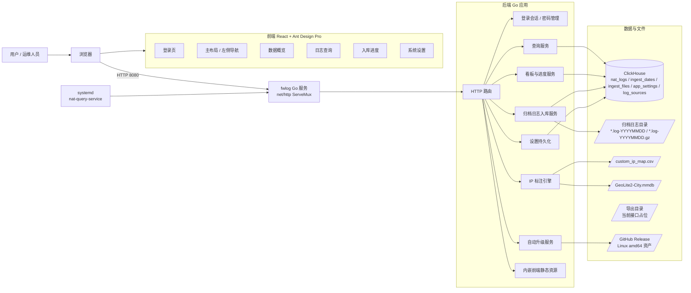

## 2. 部署架构图

```mermaid
flowchart TB
    subgraph Server142["192.168.0.142"]
        Unit[systemd: nat-query-service]
        Bin[/opt/nat-query/nat-query-service]
        App[Go 服务<br/>监听 0.0.0.0:8080]

        subgraph DataDirs["数据目录"]
            LogDir[/日志目录<br/>默认 /data/sangfor_fw_log/]
            ExportDir[/导出目录<br/>默认 /data/export/]
            GeoPath[/GeoIP 库<br/>默认 /data/index/GeoLite2-City.mmdb/]
        end

        CHServer[ClickHouse Server<br/>127.0.0.1:9000]
        CHData[(ClickHouse 数据)]
    end

    Unit --> Bin
    Bin --> App
    App -->|clickhouse-go/v2 native TCP| CHServer
    CHServer --> CHData
    App --> LogDir
    App --> ExportDir
    App --> GeoPath
```

## 3. 后端运行时模块图

```mermaid
flowchart TB
    Main[main.go<br/>LoadConfig + NewApp + Run] --> App[App]
    App --> Connect[Connect<br/>OpenClickHouse + EnsureTables + LoadSettings]
    App --> Router[Router<br/>注册 HTTP 接口]
    App --> Settings[settings map<br/>运行时配置]
    App --> ImportLock[importMu<br/>防止重复入库任务]
    App --> IPEngine[IP 标注引擎]

    Router --> SessionAPI[/api/session]
    Router --> LoginAPI[/api/login]
    Router --> LogoutAPI[/api/logout]
    Router --> PasswordAPI[/api/password]
    Router --> QueryAPI[/api/query]
    Router --> DashboardAPI[/api/health-dashboard]
    Router --> ProgressAPI[/api/ingest-progress]
    Router --> SettingsAPI[/api/settings]
    Router --> SyncAPI[/api/sync]
    Router --> RebuildAPI[/api/rebuild]
    Router --> UpgradeAPI[/api/upgrade/check<br/>/api/upgrade/status<br/>/api/upgrade/run]
    Router --> IPReloadAPI[/api/ip-data/reload]
    Router --> Static[/ 前端静态资源]

    QueryAPI --> QuerySvc[appQueryService]
    DashboardAPI --> DashboardSvc[appDashboardService]
    ProgressAPI --> DashboardSvc
    PasswordAPI --> SecuritySvc[appSecurityService]
    IPReloadAPI --> SecuritySvc
    SyncAPI --> ImportSvc[startBackgroundImport(false)]
    RebuildAPI --> ImportSvc2[startBackgroundImport(true)]
    UpgradeAPI --> UpgradeSvc[升级检查 / 后台替换二进制]

    QuerySvc --> CH[(ClickHouseStore)]
    DashboardSvc --> CH
    ImportSvc --> CH
    ImportSvc2 --> CH
    SecuritySvc --> IPEngine
```

## 4. 前端页面结构图

```mermaid
flowchart TB
    Root[web/src/main.tsx] --> SessionCheck[启动后请求 /api/session]
    SessionCheck --> Authenticated{已登录?}
    Authenticated -- 否 --> LoginPage[LoginPage]
    Authenticated -- 是 --> AppLayout[AppLayout<br/>Ant Design ProLayout]

    LoginPage -->|POST /api/login| BackendLogin[/api/login]

    AppLayout --> Nav[左侧导航]
    Nav --> Dashboard[数据概览<br/>HealthDashboard]
    Nav --> Search[日志查询<br/>LogSearchPage]
    Nav --> Progress[入库进度<br/>IncrementalProgressPage]
    Nav --> Maintenance[系统设置<br/>SystemMaintenancePage]

    Dashboard -->|GET| HealthAPI[/api/health-dashboard]
    Search -->|GET| QueryAPI[/api/query]
    Progress -->|GET| ProgressAPI[/api/ingest-progress]
    Maintenance -->|GET/POST| SettingsAPI[/api/settings]
    Maintenance -->|POST| PasswordAPI[/api/password]
    Maintenance -->|POST| IPReloadAPI[/api/ip-data/reload]
    Maintenance -->|POST| SyncAPI[/api/sync]
    Maintenance -->|POST| RebuildAPI[/api/rebuild]
    Maintenance -->|GET/POST| UpgradeAPI[/api/upgrade/*]

    AppLayout -->|POST /api/logout| LogoutAPI[/api/logout]
```

## 5. ClickHouse 数据模型图

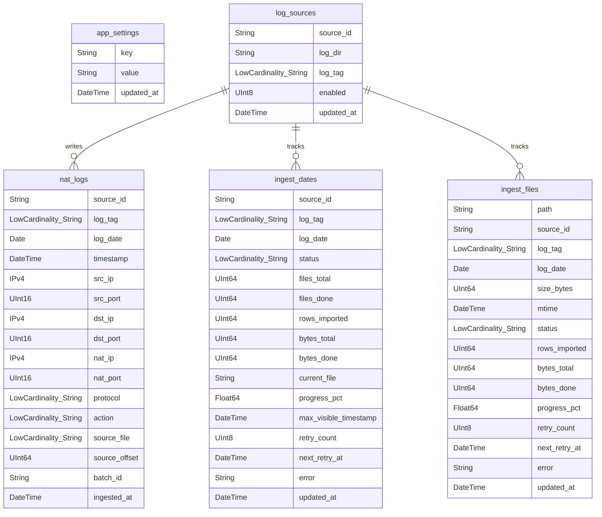

关键表职责：

- `nat_logs`：日志查询主表，按 `log_date` 分区，排序键是 `(log_date, source_id, src_ip, timestamp)`。
- `ingest_dates`：日期级入库状态，用来控制查询可见范围和前台进度。
- `ingest_files`：文件级入库状态，用来记录单文件成功、失败和重试信息。
- `app_settings`：系统设置持久化，包括日志源、自动扫描、IP 库路径、CIDR 别名等。
- `log_sources`：预留多日志源数据表；当前运行主要从 `app_settings.log_sources` 或兼容字段解析。

## 6. 服务启动流程图

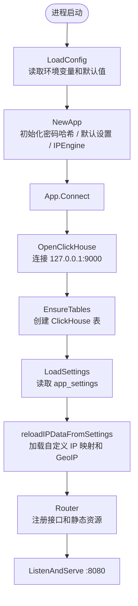

## 7. 登录与改密流程图

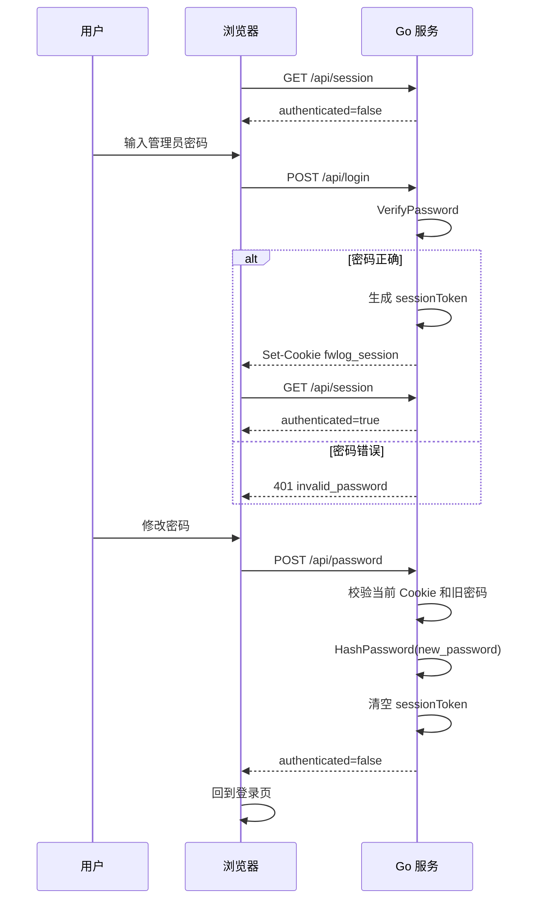

## 8. 归档日志扫描流程图

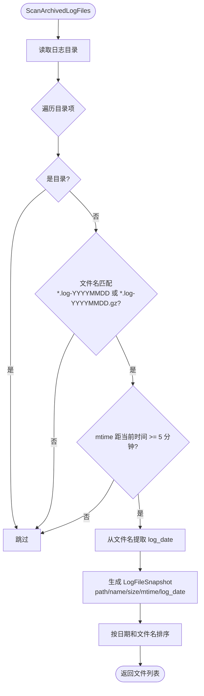

## 9. 入库流程图

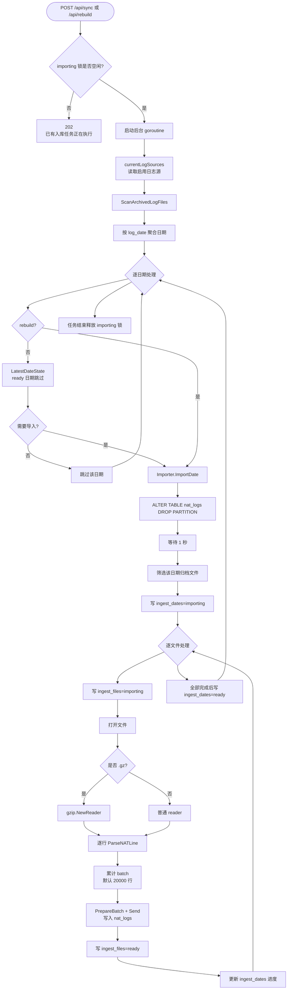

## 10. 入库状态机

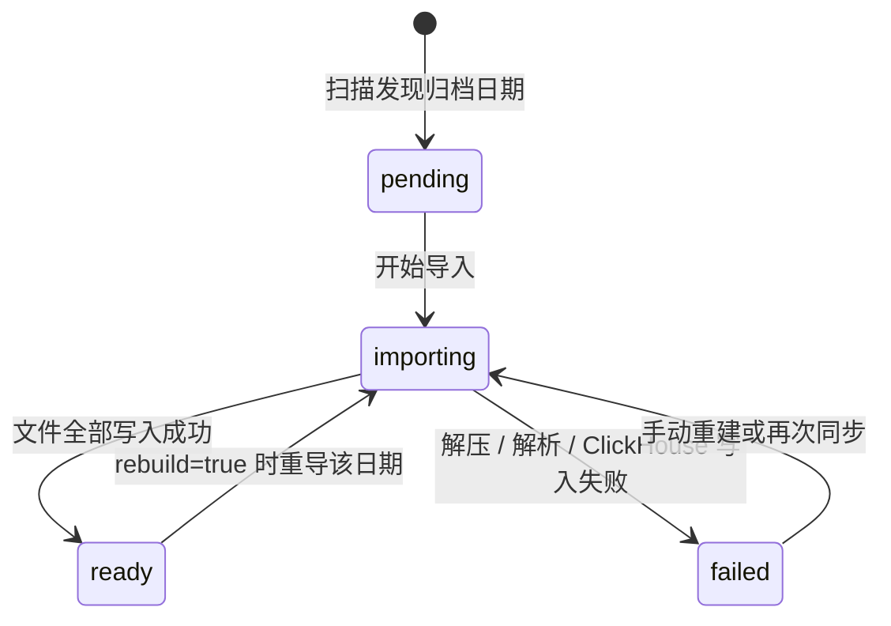

## 11. 查询流程图

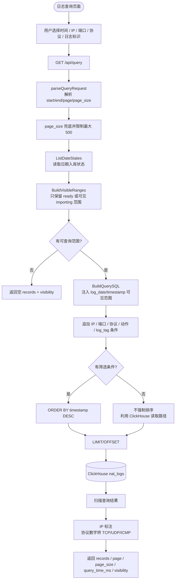

## 12. 查询可见性流程图

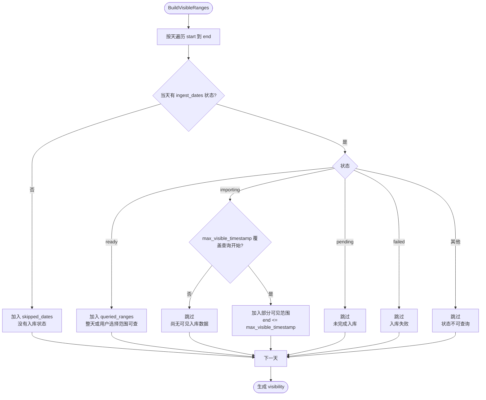

## 13. 数据概览与入库进度流程图

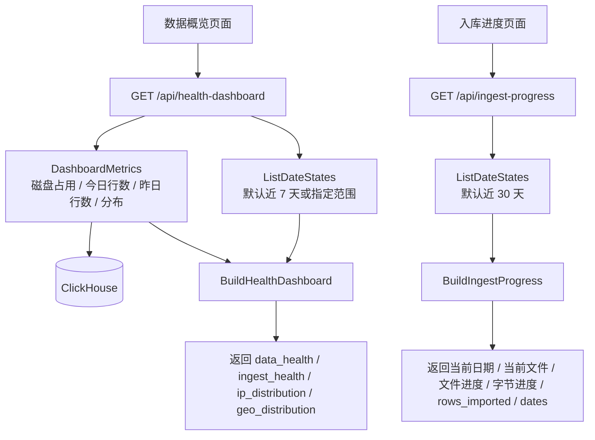

## 14. 系统设置流程图

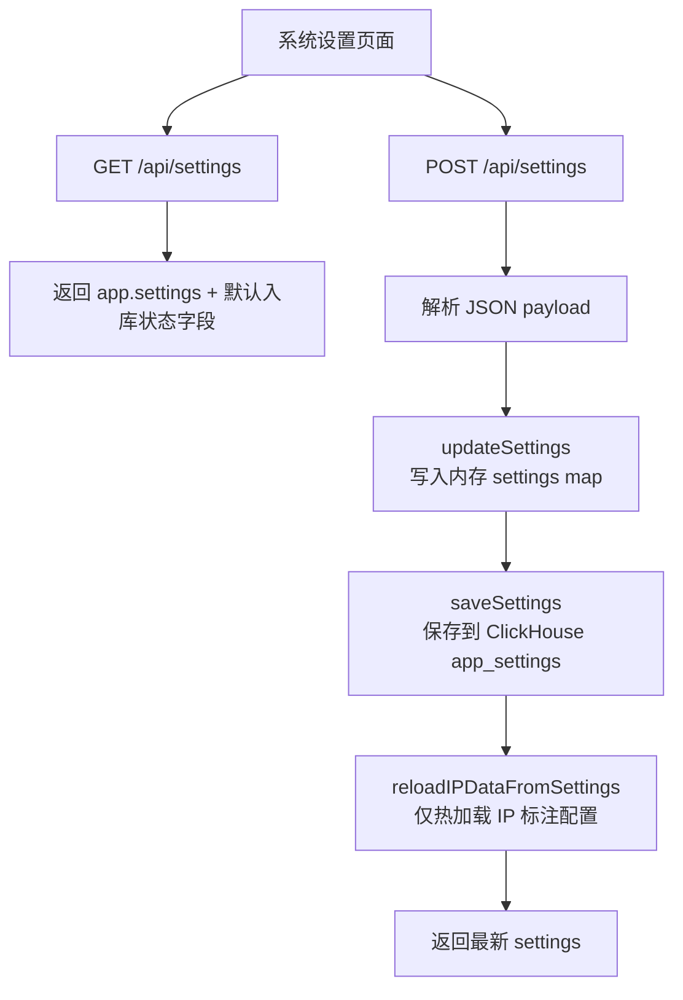

保存系统设置只负责配置落库和 IP 标注配置热加载，不再隐式触发日志扫描或入库。日志入库只通过 `POST /api/sync`、`POST /api/rebuild`，以及后续独立定时调度器触发。

## 15. IP 标注流程图

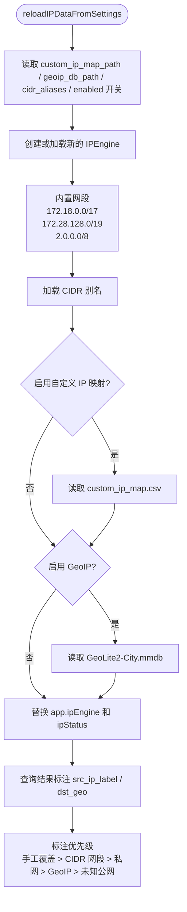

## 16. API 总览图

```mermaid
flowchart TB
    API[HTTP API :8080] --> Static[GET / 和前端 assets]
    API --> Session[GET /api/session]
    API --> Login[POST /api/login]
    API --> Logout[POST /api/logout]
    API --> Password[POST /api/password]
    API --> Query[GET /api/query]
    API --> Health[GET /api/health-dashboard]
    API --> Progress[GET /api/ingest-progress]
    API --> SettingsGet[GET /api/settings]
    API --> SettingsPost[POST /api/settings]
    API --> Sync[POST /api/sync]
    API --> Rebuild[POST /api/rebuild]
    API --> UpgradeCheck[GET /api/upgrade/check]
    API --> UpgradeStatus[GET /api/upgrade/status]
    API --> UpgradeRun[POST /api/upgrade/run]
    API --> IPReload[POST /api/ip-data/reload]
    API --> Export[POST /api/export<br/>当前占位 501]
```

## 17. CI 与 142 部署流程图

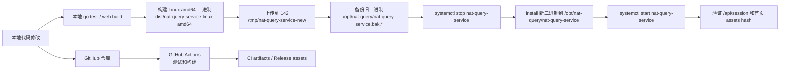

## 18. 核心数据流总图

```mermaid
flowchart LR
    RawLogs[/归档 NAT 日志/] --> Scanner[文件扫描器]
    Scanner --> DateQueue[日期集合]
    DateQueue --> Importer[Importer.ImportDate]
    Importer --> Parser[ParseNATLine]
    Parser --> Batch[ClickHouse PrepareBatch]
    Batch --> NatLogs[(nat_logs)]

    Importer --> IngestFiles[(ingest_files)]
    Importer --> IngestDates[(ingest_dates)]

    Browser[浏览器页面] --> QueryAPI[/api/query]
    QueryAPI --> IngestDates
    QueryAPI --> NatLogs
    QueryAPI --> IPEngine[IP 标注引擎]
    IPEngine --> Browser

    Browser --> HealthAPI[/api/health-dashboard]
    HealthAPI --> IngestDates
    HealthAPI --> NatLogs

    Browser --> SettingsAPI[/api/settings]
    SettingsAPI --> AppSettings[(app_settings)]
```

## 19. v1.1.0 查询优化补充

`/api/query` 在保留旧 `page` / `page_size` 参数的基础上新增 `cursor` 参数。查询结果新增 `next_cursor` 和 `has_more`，前端日志查询页通过游标栈实现上一页 / 下一页，避免持续翻页时产生深 `OFFSET`。

游标使用 base64url JSON 编码，解码后的结构如下：

```json
{
  "timestamp": "2026-07-04 12:00:00",
  "source_id": "default",
  "source_file": "fw.log-20260704",
  "source_offset": 123456
}
```

游标查询会追加稳定下一页谓词：

```sql
AND (
  timestamp < ?
  OR (
    timestamp = ?
    AND (source_id, source_file, source_offset) < (?, ?, ?)
  )
)
ORDER BY timestamp DESC, source_id DESC, source_file DESC, source_offset DESC
LIMIT page_size + 1
```

查询保护规则：

- 无筛选条件时最大查询跨度为 24 小时。
- 带 IP、端口、协议、动作或日志标识筛选时最大查询跨度为 7 天。
- 旧分页 `page > 20` 会返回 `query_too_broad`，提示改用游标或缩小范围。
- 查询超时为 10 秒，返回 `query_timeout`。
- 全局并发查询闸门为 4，超过时返回 `query_busy`。

第二到第五优先级仍保持规划状态：物化视图预聚合看板、`dst_ip` / `nat_ip` skip index、异步导出、Dictionary / Projection / 冷热分层，均需要先在真实查询与 142 资源占用下验证收益，再进入生产变更。

## 20. 自动升级补充

系统设置页维护标签新增 Release 升级卡片。该功能当前只支持人工触发，不做定时自动升级，也不绕过登录态。

后端新增接口：

- `GET /api/upgrade/check`：检查 GitHub 最新 Release，确认 `nat-query-service_linux_amd64`、`nat-query-service.service`、`deploy-142-from-release.sh` 三个 Linux 发布资产是否齐全。
- `GET /api/upgrade/status`：返回当前进程内升级状态，状态包括 `idle`、`running`、`succeeded`、`failed`。
- `POST /api/upgrade/run`：接收明确版本号，例如 `{"version":"v1.1.0"}`，后台下载 Linux amd64 二进制、备份当前 `/opt/nat-query/nat-query-service`、替换文件并执行 `systemctl restart nat-query-service`。

发布构建会通过 `-ldflags "-X main.appVersion=$version"` 注入当前版本号，供升级页显示。升级失败时记录错误和备份路径，不自动回滚。
