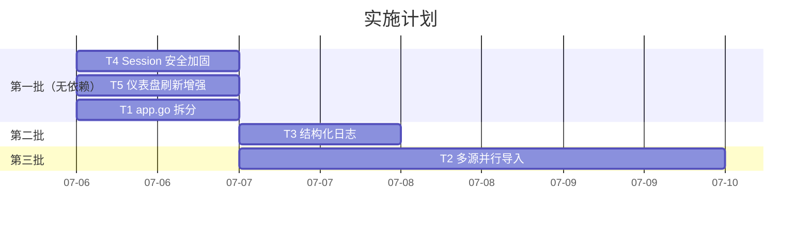

# fwlog 后续工作实施计划

---

## 任务总览

| # | 任务 | 工作量 | 依赖 |
|---|---|---|---|
| T1 | app.go 拆分职责 | 1 天 | 无 |
| T2 | 多数据源并行导入 | 2~3 天 | T1（拆分后改动更清晰） |
| T3 | 结构化日志 (log/slog) | 1 天 | 无 |
| T4 | Session 安全加固 | 半天 | 无 |
| T5 | 仪表盘自动刷新增强 | 半天 | 无 |

> T1、T3、T4 互相无依赖，可并行或按任意顺序做。T2 建议在 T1 之后，因为拆分后导入逻辑更独立。

---

## T1：app.go 拆分职责

### 现状

[app.go](file:///d:/项目工程/fwlog-v2/fwlog/internal/app/app.go) 有 **1058 行**，包含以下职责：

| 行范围 | 职责 |
|---|---|
| L17-53 | App 结构体 + 构造函数 |
| L55-82 | Router 路由注册 |
| L84-114 | Run / Connect 启动逻辑 |
| L116-141 | 默认配置 / 密码加载 |
| L153-211 | HTTP 工具函数（methodHandler, placeholderHandler） |
| L213-408 | **导入控制**（importHandler, startBackgroundImport, importConfiguredSources） |
| L239-500 | **设置管理**（getSettings, updateSettings, saveSettings, CIDR 解析等） |
| L516-562 | importArchivedDates（实际导入逻辑） |
| L564-756 | **查询服务适配器**（appQueryService + 解析 / enrichment） |
| L758-866 | **仪表盘服务适配器**（appDashboardService） |
| L868-977 | 请求解析工具函数 |
| L1025-1058 | **安全服务适配器**（appSecurityService） |

### 拆分方案

| 新文件 | 搬入内容 | 来源行数 |
|---|---|---|
| **`router.go`** | `Router()` + `methodHandler` + `placeholderHandler` + `Run` | L55-91, L153-211 |
| **`import_controller.go`** | `importHandler` + `startBackgroundImport` + `tryBeginImport` + `endImport` + `importConfiguredSources` + `importArchivedDates` + `currentLogSource(s)` + `parseEnabledLogSources` | L213-562 |
| **`settings_controller.go`** | `settingsHandler` + `getSettings` + `updateSettings` + `saveSettings` + `parseCIDRAliases` + `settingOrFallback` + `settingBoolOrFallback` | L167-514 |
| **`query_adapter.go`** | `appQueryService` + 所有方法 + `emptyQueryResponse` + `parseQueryRequest` + 解析工具 | L564-977 |
| **`dashboard_adapter.go`** | `appDashboardService` + 所有方法 + `dashboardSince` | L758-1023 |
| **`security_adapter.go`** | `appSecurityService` + `ChangePassword` + `ReloadIPData` | L1025-1058 |
| **`app.go`（瘦身后）** | `App` 结构体 + `NewApp` + `Connect` + `loadAdminPassword` + `defaultSettings` + IP 数据相关 | ~150 行 |

### 实施步骤

1. 创建新文件，搬移函数（同 package，零行为变化）
2. 确认 import 语句正确分配
3. 运行 `go build ./...` 确认编译
4. 运行 `go test ./internal/app/...` 确认全部测试通过

> [!NOTE]
> 纯文件拆分，不改函数签名，不改行为。所有现有测试必须原样通过。

---

## T2：多数据源并行导入

### 现状

当前 [importConfiguredSources](file:///d:/项目工程/fwlog-v2/fwlog/internal/app/app.go#L381-L408) **串行**遍历 sources：

```go
for _, source := range sources {
    imported, skipped, err := runner(ctx, store, source, rebuild)
    // ...
    if err != nil {
        return  // 一个 source 失败，全部停止
    }
}
```

同时 `importMu` + `importing` 全局锁确保只有一个导入任务（[L365-379](file:///d:/项目工程/fwlog-v2/fwlog/internal/app/app.go#L365-L379)）。

### 改动方案

#### 后端

##### [MODIFY] `import_controller.go`（T1 拆分后）

- 将 `importing bool` 改为 `importingSources map[string]bool`，**按 source_id 粒度加锁**
- `importConfiguredSources` 使用 `sync.WaitGroup` + goroutine 并行执行各 source
- 每个 source 独立记录成功/失败/跳过，一个 source 失败不影响其他 source
- 新增 `maxConcurrentImports` 配置（默认 `len(sources)` 或 Config.Workers）

```go
// 核心变更示意
type App struct {
    // ...
    importMu         sync.Mutex
    importingSources map[string]bool  // 替代 importing bool
}

func (a *App) importConfiguredSources(ctx context.Context, store *ClickHouseStore, rebuild bool) ImportResult {
    sources := a.currentLogSources()
    var wg sync.WaitGroup
    results := make(chan sourceResult, len(sources))

    for _, source := range sources {
        if !a.tryBeginSourceImport(source.SourceID) {
            continue  // 该 source 已在导入，跳过
        }
        wg.Add(1)
        go func(src LogSource) {
            defer wg.Done()
            defer a.endSourceImport(src.SourceID)
            imported, skipped, err := runner(ctx, store, src, rebuild)
            results <- sourceResult{src.SourceID, imported, skipped, err}
        }(source)
    }
    // ...
}
```

##### [MODIFY] `ingest_state_store.go`

- `DateIngestState` 已经有 `SourceID` 字段，ClickHouse 写入天然按 source 分离，无需改动存储层

##### [MODIFY] `dashboard_service.go`

- `IngestHealth` 当前只展示单个 source 的进度，改为返回 `[]IngestHealth`（各 source 独立进度）
- 兼容旧字段：如果只有一个 source，行为不变

#### 前端

##### [MODIFY] `HealthDashboard.tsx`

- `ingest_health` 支持数组，展示多 source 并行进度条
- 每个 source 显示独立的：source_id / log_tag / progress_pct / status

##### [MODIFY] `IncrementalProgressPage.tsx`

- 进度表格增加 source_id 列，支持筛选

### 实施步骤

1. 后端：重构 import 锁粒度（按 source_id）
2. 后端：`importConfiguredSources` 改为并发执行
3. 后端：Dashboard API 支持多 source 进度
4. 前端：适配多 source 进度展示
5. 编写测试：并发两个 source 导入、单 source 重复请求拒绝
6. 全量测试

---

## T3：结构化日志 (log/slog)

### 现状

当前后端**没有任何日志输出**——既没有 `log.Printf` 也没有 `fmt.Println`。所有错误通过 HTTP JSON 返回，服务端完全静默。

这意味着：
- 导入成功/失败没有日志
- HTTP 请求没有访问日志
- ClickHouse 连接问题没有日志
- 自动扫描触发没有日志

### 改动方案

使用 Go 1.21 内置的 `log/slog`，零外部依赖。

##### [NEW] `logging.go`

```go
package app

import (
    "log/slog"
    "os"
)

func initLogger() *slog.Logger {
    return slog.New(slog.NewJSONHandler(os.Stdout, &slog.HandlerOptions{
        Level: slog.LevelInfo,
    }))
}
```

##### [MODIFY] `app.go`

- `App` 结构体添加 `logger *slog.Logger` 字段
- `NewApp` 中初始化 logger

##### 各模块添加日志的关键位置

| 文件 | 日志点 | 级别 |
|---|---|---|
| `router.go` | HTTP 请求开始/结束（中间件） | Info |
| `import_controller.go` | 导入开始 / 完成 / 失败 / 跳过 | Info / Error |
| `app.go` Connect | ClickHouse 连接成功/失败 | Info / Error |
| `session_auth.go` | 登录成功/失败 | Warn |
| `upgrade_service.go` | 升级检查/执行/结果 | Info / Error |
| `scheduler.go` | 自动扫描触发 | Info |

##### 日志格式示例

```json
{"time":"2026-07-05T20:30:00+08:00","level":"INFO","msg":"import completed","source_id":"default","dates_imported":3,"dates_skipped":25,"duration_sec":42}
{"time":"2026-07-05T20:30:01+08:00","level":"INFO","msg":"http request","method":"GET","path":"/api/query","status":200,"duration_ms":128}
```

### 实施步骤

1. 创建 `logging.go`，初始化 slog logger
2. App 注入 logger
3. 添加 HTTP 请求日志中间件
4. 在导入、连接、认证、升级等关键路径添加日志
5. 运行测试确认无回归

---

## T4：Session 安全加固

### 现状审计

审查 [session_auth.go](file:///d:/项目工程/fwlog-v2/fwlog/internal/app/session_auth.go) 后：

| 检查项 | 状态 | 说明 |
|---|---|---|
| Token 随机性 | ✅ 安全 | `crypto/rand` 生成 32 字节（L117-121） |
| HttpOnly | ✅ 已设置 | L129 |
| SameSite | ✅ Lax | L130 |
| Secure 标志 | ❌ **缺失** | HTTPS 场景下 cookie 可能被明文传输 |
| MaxAge / 过期 | ❌ **缺失** | 登录后永不过期（直到服务重启或登出） |
| 单 token 设计 | ⚠️ 风险 | `a.sessionToken` 只存一个，新登录会踢掉旧会话 |
| 暴力破解防护 | ❌ **缺失** | 登录接口无速率限制 |

### 改动方案

##### [MODIFY] `session_auth.go`

```go
func buildSessionCookie(token string) *http.Cookie {
    return &http.Cookie{
        Name:     sessionCookieName,
        Value:    token,
        Path:     "/",
        HttpOnly: true,
        SameSite: http.SameSiteLaxMode,
+       Secure:   true,              // 新增：HTTPS 传输保护
+       MaxAge:   86400,             // 新增：24 小时过期
    }
}
```

##### [MODIFY] `session_auth.go` — 登录频率限制

```go
// 新增简单的失败计数器
type loginLimiter struct {
    mu       sync.Mutex
    failures int
    lastFail time.Time
}

func (l *loginLimiter) check() error {
    l.mu.Lock()
    defer l.mu.Unlock()
    if l.failures >= 5 && time.Since(l.lastFail) < 5*time.Minute {
        return fmt.Errorf("登录尝试过于频繁，请 5 分钟后重试")
    }
    return nil
}
```

### 实施步骤

1. Cookie 加 `Secure: true` + `MaxAge: 86400`
2. 添加登录频率限制（5 次失败 / 5 分钟冷却）
3. 登录失败记录日志（配合 T3）
4. 更新 `auth_test.go` 覆盖新逻辑
5. 运行全量测试

---

## T5：仪表盘自动刷新增强

### 现状

[HealthDashboard.tsx](file:///d:/项目工程/fwlog-v2/fwlog/web/src/pages/HealthDashboard.tsx#L332-L347) **已有自动刷新**：

```tsx
// 摘要数据：导入中 5s，空闲 30s
React.useEffect(() => {
  const summaryTimer = window.setInterval(
    () => void loadSummary(),
    data?.ingest_health?.status === 'importing' ? 5000 : 30000,
  );
  return () => window.clearInterval(summaryTimer);
}, [loadSummary, data?.ingest_health?.status]);

// 排行数据：固定 5 分钟
const rankingTimer = window.setInterval(() => void loadRankings(), 300000);
```

### 可增强点

| 增强项 | 说明 |
|---|---|
| 用户可选刷新间隔 | 右上角下拉菜单：5s / 15s / 30s / 1min / 5min / 关闭 |
| 刷新状态指示 | 显示上次刷新时间 + 倒计时进度 |
| 页面不可见时暂停 | `document.visibilitychange` 事件，切到后台时停止刷新 |

##### [MODIFY] `HealthDashboard.tsx`

- 添加 `refreshInterval` state + UI 选择器
- 添加 `useEffect` 监听 `document.visibilitychange`
- 显示 "上次刷新: X秒前" 提示

### 实施步骤

1. 添加刷新间隔选择 UI（Segmented 或 Select）
2. 用选择的间隔替代硬编码的 5000/30000
3. 添加 visibility API 暂停机制
4. 添加上次刷新时间显示

---

## 执行顺序建议



> [!IMPORTANT]
> 确认以上计划是否符合你的预期？选定后我可以直接开始动手。
